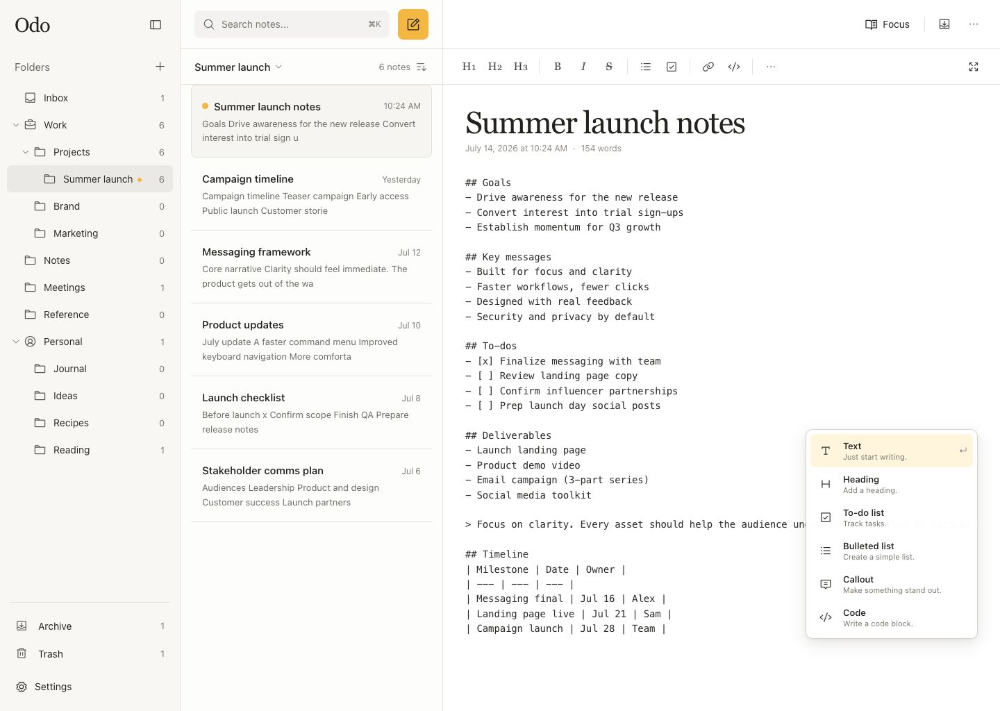

# Odo Notes

A calm, local-first Markdown notes workspace built with [Tauri 2](https://v2.tauri.app/), TypeScript, Vite, and Rust.



## Highlights

- Nested folders and a fast, searchable notes list
- Markdown-first editor with formatting controls and a `/` block menu
- Obsidian-style `-` lists and `- []` todo normalization
- Note and folder creation, sorting, archive/trash views, and focus mode
- Autosave and local workspace persistence
- Keyboard shortcuts for search, creation, saving, and focus mode
- Native macOS menu-bar controls and a local MCP server for notes, folders, tasks, and journals

## Odo MCP Server

The desktop app includes an MCP server with both standard local transports:

- Streamable HTTP at `http://127.0.0.1:8765/mcp` by default
- `stdio` through the installed Odo executable with the `--mcp-stdio` argument

Open **Settings → Odo MCP Server** to start or stop the server, change the bind address or preferred port, enable an optional bearer token, allow permanent deletion, configure start-at-login, and copy client configuration snippets. Closing the main window keeps Odo and an enabled HTTP server running in the menu bar.

The MCP surface includes revision-safe note operations, nested folder management, planner and Markdown tasks, journal entries, search, atomic batches, backups, resources with subscriptions, five workflow prompts, and a redacted activity log retained for 60 days. Permanent note deletion is disabled separately by default.

## Prerequisites

- Node.js 20.19 or newer
- Rust stable
- The platform dependencies listed in the [Tauri prerequisites](https://v2.tauri.app/start/prerequisites/)

## Development

```sh
npm install
npm run tauri dev
```

Useful commands:

- `npm run dev` starts the frontend in a browser.
- `npm run build` type-checks and builds the frontend.
- `npm run check` builds the frontend and checks the Rust crate.
- `npm run tauri build` creates a desktop application bundle.

## OpenSpec

OpenSpec is installed as a development dependency and initialized for Codex. Specifications live in `openspec/specs`, while proposed changes live in `openspec/changes`.

Start a change from Codex with `/opsx:propose`, or inspect current changes from the terminal:

```sh
npm run spec:list
```

The default workflow is propose, apply, sync, and archive. Generated Codex workflow skills are stored in `.codex/skills` so the setup is shared with the repository.

## Pull requests

Work on a feature branch and submit a pull request into `main`. The intended repository rule requires a pull request while requiring zero approving reviews.
