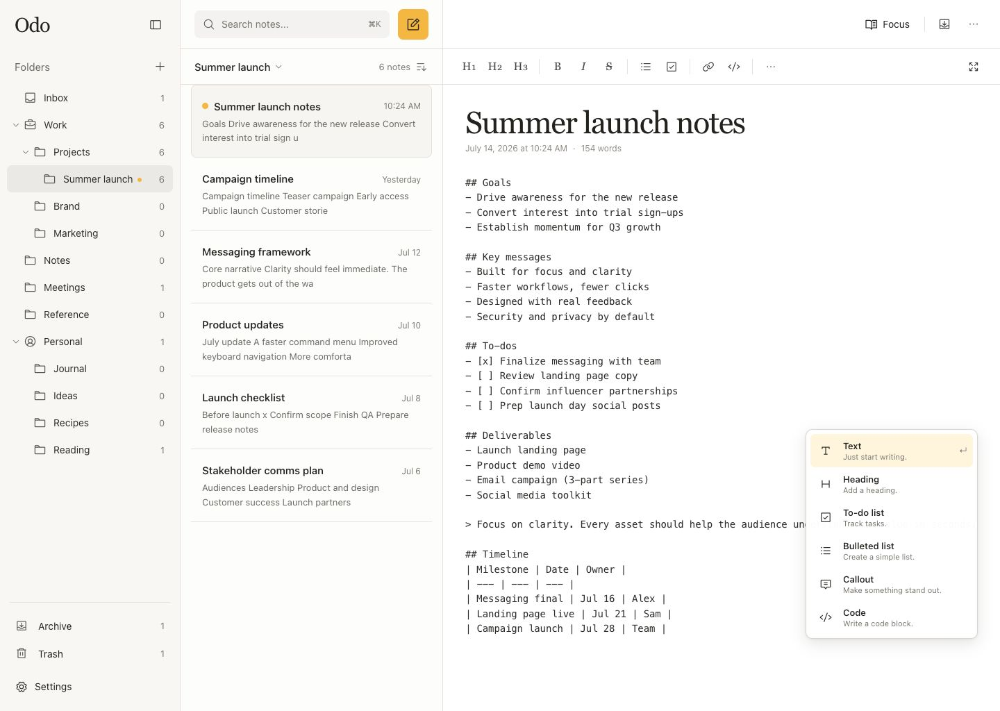

# Odo Tasks

A calm, local-first Markdown notes workspace built with [Tauri 2](https://v2.tauri.app/), TypeScript, Vite, and Rust.



## Highlights

- Nested folders and a fast, searchable notes list
- Markdown-first editor with formatting controls and a `/` block menu
- Obsidian-style `-` lists and `- []` todo normalization
- Note and folder creation, sorting, archive/trash views, and focus mode
- Autosave and local workspace persistence
- Keyboard shortcuts for search, creation, saving, and focus mode
- Native macOS menu-bar controls and a local MCP server for notes, folders, tasks, and journals
- Local REST API with OpenAPI 3.1 spec and an in-app API docs / playground for Devin CLI, Codex CLI, and other agents
- iCalendar `.ics` feed of scheduled tasks that works with external calendar apps
- OpenAI-powered AI assistant with web search that can find real-world events and add them to your schedule
- Month calendar view for scheduled tasks

## Odo MCP Server

The desktop app includes an MCP server with both standard local transports:

- Streamable HTTP at `http://127.0.0.1:8765/mcp` by default
- `stdio` through the installed Odo executable with the `--mcp-stdio` argument

Open **Settings → Odo MCP Server** to start or stop the server, change the bind address or preferred port, enable an optional bearer token, allow permanent deletion, configure start-at-login, and copy client configuration snippets. Closing the main window keeps Odo and an enabled HTTP server running in the menu bar.

The MCP surface includes revision-safe note operations, cycle-safe nested folder management with a strict 50-icon allowlist, planner and Markdown tasks, journal entries, paginated search and list tools, atomic batches, backups, described Markdown resources with subscriptions, five described workflow prompts, and a redacted activity log retained for 60 days. Permanent note deletion is disabled separately by default.

## Odo REST API

The desktop app also exposes a local REST API on the same port as the HTTP MCP server:

- Base URL: `http://127.0.0.1:8765/api/v1` by default
- OpenAPI spec: `http://127.0.0.1:8765/api/v1/openapi.json`
- Endpoints for notes, tasks, folders, workspace summary, and an iCalendar feed at `/calendar.ics`
- Optional bearer-token auth uses the same token as the MCP server, and `.ics` URLs can include `?token=<token>` so calendar apps can subscribe

Open **API** in the sidebar to browse the docs, or **API playground** to send requests. Agents like Devin CLI and Codex CLI can call these endpoints directly when the MCP server is enabled.

## AI assistant

Open **AI** in the sidebar to chat with an AI assistant. The assistant can:

- Search the web for real-world events
- List and search your existing tasks and notes
- Add events it finds to your schedule as scheduled tasks

It uses OpenRouter by default with the `openrouter/free` model router, and also supports OpenAI directly. Add an API key in **Settings → AI assistant** to enable it. The key is stored in the OS credential store (Windows Credential Manager / macOS Keychain / Linux Secret Service). Web search and automatic task creation are controlled by separate toggles.

For local development you can set `OPENROUTER_API_KEY`, `OPENAI_API_KEY`, `ODO_AI_PROVIDER`, `ODO_AI_MODEL`, or `ODO_AI_BASE_URL` instead of saving a key in the UI.

## Prerequisites

- Node.js 20.19 or newer
- Rust stable
- The platform dependencies listed in the [Tauri prerequisites](https://v2.tauri.app/start/prerequisites/)

## Development

```sh
npm install
npm run tauri dev
```

Useful commands:

- `npm run dev` starts the frontend in a browser.
- `npm run build` type-checks and builds the frontend.
- `npm run check` builds the frontend and checks the Rust crate.
- `npx playwright install chromium` installs the browser used by end-to-end tests.
- `npm run test:e2e` runs the browser regression suite.
- `npm run tauri build` creates a desktop application bundle.

On Windows with the `x86_64-pc-windows-gnu` toolchain, the `[lib] crate-type` does not include `cdylib`. This avoids the PE/COFF 65,535 export-ordinal limit that large Tauri dependency trees can hit. Add `cdylib` back if you need to build for Android.

## OpenSpec

OpenSpec is installed as a development dependency and initialized for Codex. Specifications live in `openspec/specs`, while proposed changes live in `openspec/changes`.

Start a change from Codex with `/opsx:propose`, or inspect current changes from the terminal:

```sh
npm run spec:list
```

The default workflow is propose, apply, sync, and archive. Generated Codex workflow skills are stored in `.codex/skills` so the setup is shared with the repository.

## Pull requests

Work on a feature branch and submit a pull request into `main`. The intended repository rule requires a pull request while requiring zero approving reviews.
